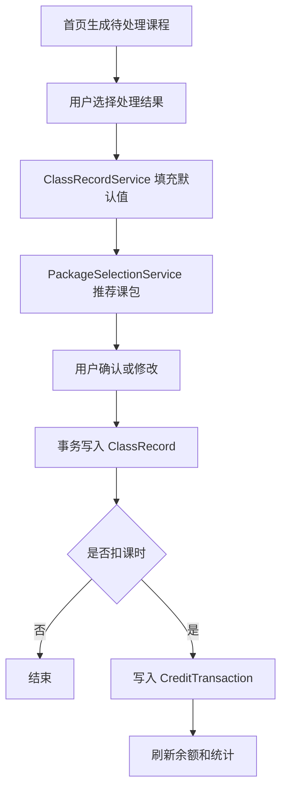
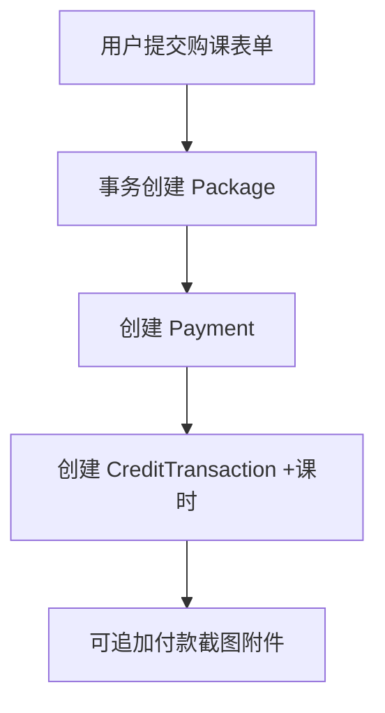

# 工程架构设计

## 架构目标

第一版工程架构服务于三个目标：

- 让家长的日常记录路径足够短。
- 让课包、课时流水、费用、附件和备份规则可靠可追溯。
- 让 AI agent 可以按清晰边界持续开发，不互相踩代码。

## 推荐仓库结构

Flutter 工程建议放在 `app/` 下，保留根目录作为产品和工程文档区。

```text
class2data/
  AGENTS.md
  docs/
    story.md
    interest-class-app-design.md
    engineering/
      README.md
      architecture.md
      domain-model.md
      feature-slices.md
      implementation-roadmap.md
      ai-agent-workflow.md
      quality-gates.md
  app/
    pubspec.yaml
    analysis_options.yaml
    lib/
      main.dart
      app/
        app.dart
        router.dart
        theme.dart
        bootstrap.dart
      core/
        errors/
        logging/
        time/
        ids/
        result/
        widgets/
      data/
        database/
          app_database.dart
          tables/
          daos/
          converters/
          migrations/
        files/
          app_file_store.dart
          attachment_store.dart
        repositories/
      domain/
        entities/
        value_objects/
        services/
        repositories/
      features/
        home/
        children/
        courses/
        schedules/
        packages/
        class_records/
        credit_ledger/
        payments/
        achievements/
        attachments/
        contacts/
        statistics/
        backup/
        settings/
      shared/
        presentation/
        providers/
        validators/
    test/
    integration_test/
```

如果未来 Flutter 命令必须在仓库根目录生成项目，也要尽量保留同等分层，不要把业务逻辑混入页面文件。

## 分层依赖

依赖方向固定为：

```text
Presentation -> Application/Feature Controller -> Domain -> Repository Interface
                                                -> Data Repository -> Drift/File Store
```

约束：

- 页面和组件只负责展示、输入和导航。
- Riverpod provider 负责装配依赖和暴露状态。
- 业务服务负责销课、选课包、统计、备份等规则。
- Repository 负责持久化读写，不能包含会改变业务含义的决策。
- Drift DAO 只封装数据库查询，不直接驱动 UI 流程。

## 层职责

### `app/`

应用启动、路由、主题和全局 ProviderScope 初始化。

### `core/`

跨功能的基础设施，例如时间、ID、错误、日志、通用结果类型、通用控件。只有被至少两个功能复用时才放入 `core/`。

### `domain/`

领域实体、值对象、仓储接口和纯业务服务。优先保持 Dart 纯逻辑，方便单元测试。

重点服务：

- `ScheduleOccurrenceService`：从上课计划生成近期待处理课程。
- `ClassRecordService`：保存上课记录并决定是否生成课时流水。
- `PackageSelectionService`：根据历史记录和可用课包推荐扣课包。
- `CreditBalanceService`：基于课时流水计算课包和课程余额。
- `StatisticsService`：课程统计、孩子时间线、照片墙聚合。
- `BackupService`：导出、校验和恢复备份包。

### `data/`

Drift 表、DAO、迁移、Repository 实现、文件存储实现。

规则：

- 数据库字段用稳定英文代码，界面显示走中文文案或标签表。
- 涉及多表写入时使用数据库事务。
- 附件写入采用“复制文件到私有目录 -> 写入元数据”的流程；失败时清理临时文件。

### `features/`

按用户能力切分，而不是按技术类型切分。每个 feature 可以包含：

```text
feature_name/
  presentation/
  application/
  providers/
  widgets/
```

只有该功能内部使用的组件留在功能目录内；跨功能复用后再提升到 `shared/` 或 `core/`。

## 路由结构

第一版建议使用底部导航加详情页：

- 首页：今天和本周待处理课程。
- 课程：按孩子查看课程、课包、计划和记录。
- 回顾：统计、时间线、照片墙。
- 设置：备份、恢复、导出、标签管理、隐私设置。

详情页通过 go_router 命名路由管理，路由参数只传 ID，不传完整对象。

## 状态管理

使用 Riverpod。

约束：

- 数据读取优先用 `StreamProvider` 或 `FutureProvider` 包装 Repository 查询。
- 表单状态用局部 controller 或 `Notifier`，不要把临时输入散落到全局状态。
- 写操作通过 application service 暴露命令方法，例如 `recordClass()`、`purchasePackage()`。
- Provider 命名要表达业务语义，例如 `todayScheduleProvider`，不要命名成 `dataProvider1`。

## 关键业务数据流

### 记录一节计划课



### 续费或购课



## UI 设计约束

- 手机端优先，常用操作一屏内完成。
- 首页是行动入口，不是档案列表。
- 表单默认值必须能减少输入，但每次记录都允许临时修改。
- 中文文案短、明确、贴近日常家长用语。
- 统计页区分“上课次数”“实际上课时长”“消耗课时”“费用投入”。
- 不做营销落地页，不做复杂后台式界面。

## 扩展边界

第一版预留但不实现：

- 云同步。
- 多用户协作。
- 自动识别微信截图。
- 完整寒暑假自动排课算法。
- iOS 特定能力。

可以在数据模型中保留演进空间，但不要为了未来功能牺牲第一版简单性。
