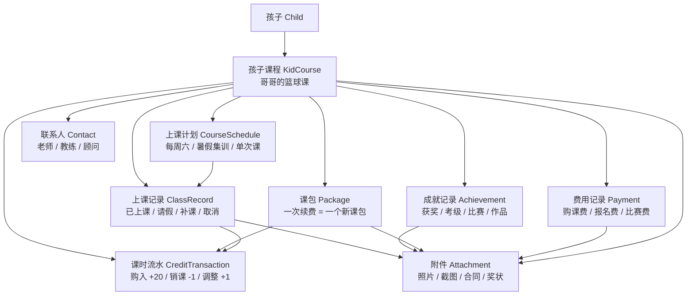
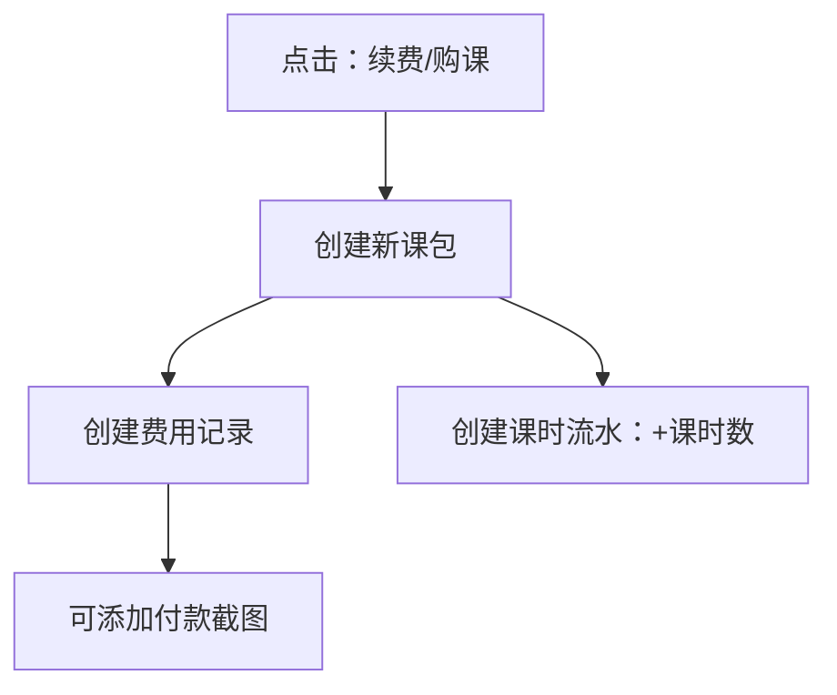
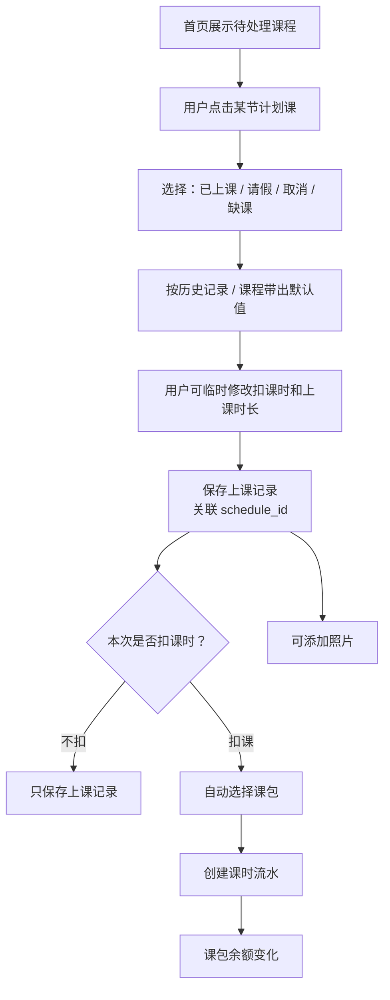
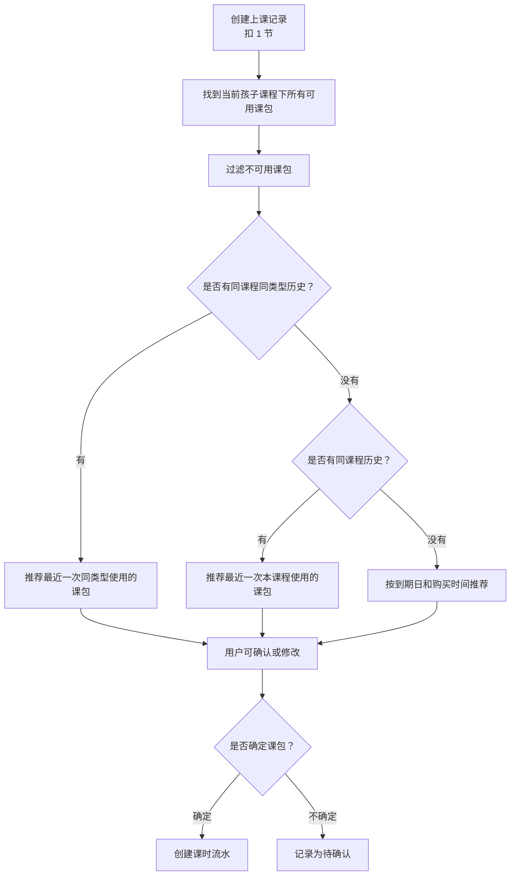
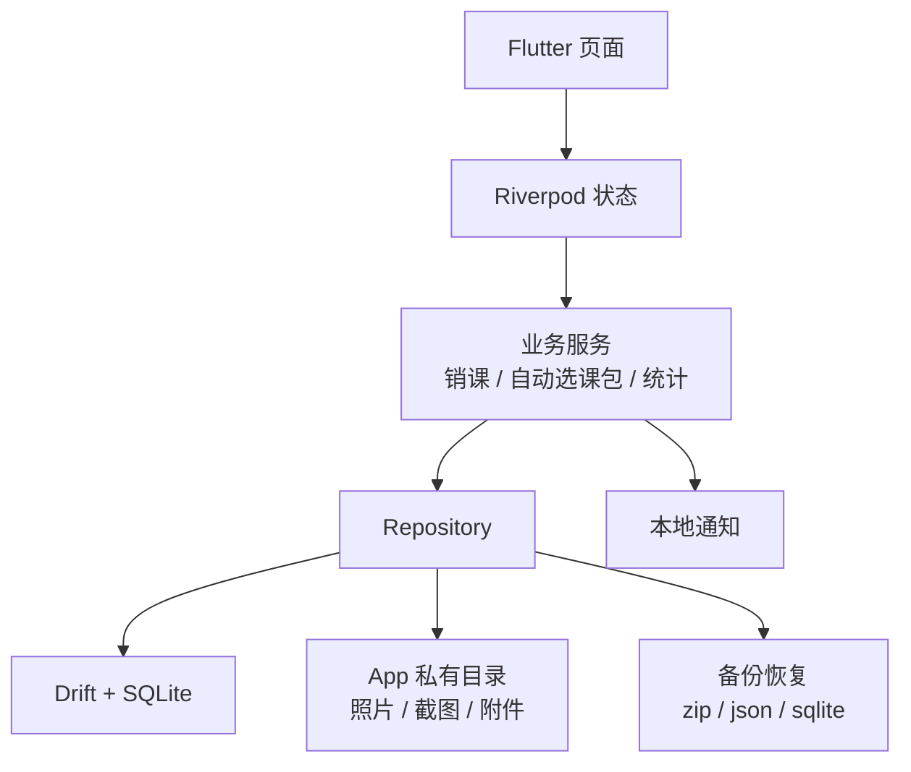

# 课小记 第一版方案

## 背景

家里有多个孩子，每个孩子可能同时参加多个课外兴趣班。不同课程的购课、销课、请假、补课、寒暑假班、集训和费用规则并不一致，且数据分散在机构小程序、老师表格、微信群通知和家长自己的记忆里。

课小记的目标不是做一个复杂的培训机构管理系统，而是做一个家长手机端自用的、数据在自己手上的课外班记录工具。

## 产品定位

一句话定位：

> 手机优先、本地数据优先的家庭课外班账本和成长档案。

核心诉求：

- 快速记录孩子每次上课、销课、请假、补课。
- 清楚知道每门课还剩多少课时、花了多少钱、上了多少次、上了多长时间。
- 支持不同课程的课包规则，比如课时包、周期卡、寒暑假班、集训课。
- 每次续费形成一个新的课包，方便回顾和对账。
- 照片、付款截图、奖状等附件默认存放在 App 私有目录，数据默认不散落到系统相册或文件管理器。
- 支持备份、恢复和导出，保证数据属于用户自己。

## 第一版范围

第一版优先解决日常刚需：

- 孩子管理
- 孩子的课程管理
- 上课计划管理
- 寒暑假班计划录入和冲突提示
- 上课类型标签
- 课包和续费记录
- 上课、销课、请假、补课记录
- 课时流水
- 费用记录
- 成就记录
- 照片和附件
- 联系人
- 课程统计和照片墙
- 本地备份和恢复
- 默认发布支持 Android、鸿蒙、iOS

第一版暂不优先做：

- 云同步
- 多用户协作
- Web 后台
- 机构管理系统
- 复杂 AI 自动识别
- 完整自动排课算法
- 备份包密码加密

## 核心概念

第一版不单独维护复杂的机构档案。用户真正关心的是“某个孩子的一门课”。

### 类型和选项策略

文档中有不少 `type`、`category`、`role` 字段。它们不应该全部采用同一种自定义策略，否则后续统计、筛选和对账会变得混乱。

第一版建议分成两类：

**系统语义类型**

这些字段有明确的底层含义，会影响余额计算、系统逻辑或对象归属，不允许用户修改预置名称，也不建议用户新增系统语义。

- `Package.type`
- `CourseSchedule.schedule_type`
- `CreditTransaction.type`
- `Attachment.owner_type`
- `Attachment.file_type`

处理方式：

- 使用固定预置选项。
- 不允许重命名预置项。
- 不允许随意新增会参与系统计算的新类型。
- 特殊情况用“其他”类型加备注解决。

**普通分类标签**

这些字段主要用于展示、筛选和统计，不直接决定课时余额或系统计算。

- `KidCourse.category`
- `CourseSchedule.class_type`
- `ClassRecord.class_type`
- `Payment.type`
- `Achievement.type`
- `Contact.role`

处理方式：

- 系统提供预置选项。
- 预置选项不建议改名，避免统计名称前后不一致。
- 用户可以新增自定义选项。
- 用户可以隐藏不用的预置选项。
- 历史记录应保存当时选择的显示名称，避免后续调整选项影响历史理解。

### 孩子 Child

表示家里的孩子。

字段说明：

| 字段        | 含义                                            |
| ----------- | ----------------------------------------------- |
| id          | 孩子的唯一标识，系统内部使用。                  |
| name        | 孩子的正式名称或常用名称，例如“哥哥”“妹妹”。    |
| nickname    | 昵称，可选；用于界面展示更亲切的称呼。          |
| avatar_path | 头像文件路径，可选；头像文件放在 App 私有目录。 |
| birthday    | 生日，可选；后续可用于年龄展示和成长回顾。      |
| note        | 备注，可选；记录孩子相关的补充信息。            |
| created_at  | 创建时间，记录这条孩子数据什么时候创建。        |
| updated_at  | 更新时间，记录这条孩子数据最后一次修改时间。    |

### 孩子课程 KidCourse

这是第一版最核心的对象。

它表示“某个孩子正在上的某门课”，例如：

- 哥哥的篮球课
- 妹妹的钢琴课
- 哥哥的搏击课

字段说明：

| 字段                     | 含义                                                                         |
| ------------------------ | ---------------------------------------------------------------------------- |
| id                       | 孩子课程的唯一标识，系统内部使用。                                           |
| child_id                 | 关联的孩子 id，表示这门课属于哪个孩子。                                      |
| name                     | 课程名称，例如“篮球”“钢琴”“搏击”。                                           |
| category                 | 课程类别，普通分类标签；例如体育、音乐、美术、学科、其他，可新增自定义类别。 |
| organization_name        | 机构名称，可选；只作为文本记录，不单独维护机构表。                           |
| location                 | 上课地点，可选；例如球馆地址、教室地址。                                     |
| status                   | 课程状态，例如进行中、暂停、已结束。                                         |
| default_credit_cost      | 默认每次消耗多少课时，例如 1、1.5、2；创建上课记录时自动带出。               |
| default_duration_minutes | 默认每次上课多长时间，单位分钟；用于统计累计上课时长。                       |
| note                     | 备注，可选；记录课程规则、注意事项等。                                       |
| created_at               | 创建时间，记录这门孩子课程什么时候创建。                                     |
| updated_at               | 更新时间，记录这门孩子课程最后一次修改时间。                                 |

说明：

- `organization_name` 只是一个可选文本字段，不单独建机构表。
- 课程联系人通过 `Contact` 挂在 `KidCourse` 下。

### 上课计划 CourseSchedule

表示某门孩子课程未来或规律性的上课安排。

它回答的是：

> 这门课通常什么时候上？

一个孩子课程可以有多个上课计划，例如：

```text
哥哥的篮球课
- 常规课计划：每周六 09:00-10:30
- 暑假集训计划：7 月 10 日至 7 月 20 日，每天 14:00-16:00
- 赛前辅导计划：指定几天晚上 19:00-20:30
```

字段说明：

| 字段 | 含义 |
| --- | --- |
| id | 上课计划的唯一标识，系统内部使用。 |
| kid_course_id | 关联的孩子课程 id，表示这个计划属于哪门孩子课程。 |
| title | 计划名称，例如“周六常规课”“2026 暑假集训”。 |
| schedule_type | 计划类型，系统语义类型；例如每周重复、每天重复、单次、指定日期列表。 |
| class_type | 上课类型，普通分类标签；例如常规课、暑假班、集训、补课，可新增自定义类型。 |
| start_date | 计划开始日期。 |
| end_date | 计划结束日期，可选；长期有效计划可以为空。 |
| weekdays | 周几上课，可为空；每周重复计划使用，例如周六。 |
| specific_dates | 指定上课日期列表，可为空；指定日期列表计划使用。 |
| start_time | 上课开始时间。 |
| end_time | 上课结束时间。 |
| location | 上课地点，可选；默认可沿用 `KidCourse.location`。 |
| status | 计划状态，例如启用、暂停、结束。 |
| note | 备注，可选；记录计划说明、特殊安排等。 |
| created_at | 创建时间，记录这个计划什么时候创建。 |
| updated_at | 更新时间，记录这个计划最后一次修改时间。 |

原则：

- `CourseSchedule` 是计划，不代表已经上课。
- 首页最近一天或最近一周的课程安排，从启用状态的 `CourseSchedule` 生成。
- 用户点击计划生成的某一节课后，选择已上课、请假、取消等操作，再创建 `ClassRecord`。
- 一个计划可以生成很多次待处理课程，但不是每次都要提前写入数据库；第一版可以运行时计算最近一周。

### 课包 Package

每次续费或购课都创建一个新的课包。

不建议第一版做“追加到旧课包”，因为会让有效期、单价、赠课、退款和对账变复杂。

字段说明：

| 字段          | 含义                                                                                 |
| ------------- | ------------------------------------------------------------------------------------ |
| id            | 课包的唯一标识，系统内部使用。                                                       |
| kid_course_id | 关联的孩子课程 id，表示这个课包属于哪门孩子课程。                                    |
| name          | 课包名称，例如“2026 春季篮球课包”。可自动生成，也允许手动修改。                      |
| type          | 课包类型，系统语义类型；例如课时包、周期卡、寒假包、暑假包、集训包、赠课包、单次课。 |
| purchased_at  | 购买日期或续费日期。                                                                 |
| valid_from    | 生效日期，可选；用于判断课包什么时候开始可用。                                       |
| valid_to      | 到期日期，可选；用于判断课包是否过期。                                               |
| total_credits | 购买的总课时数，可为空；周期卡或不限次卡可能没有固定课时数。                         |
| amount        | 本次购课或续费金额，可为空；赠课包或无法确认金额时可以不填。                         |
| status        | 课包状态，例如未开始、使用中、已用完、已过期、作废。                                 |
| note          | 备注，可选；记录赠课、特殊规则、机构说明等。                                         |
| created_at    | 创建时间，记录课包什么时候创建。                                                     |
| updated_at    | 更新时间，记录课包最后一次修改时间。                                                 |

原则：

- 课包本身只表示一次购课、续费或赠课形成的权益。
- `Package.type` 有底层业务含义，不允许用户修改预置名称。
- 课包不声明“适用哪些上课类型”，避免把现实规则写死。
- 课包不维护默认扣课时和默认上课时长，避免和孩子课程默认值重复。
- 本次上课扣哪个课包，由 `ClassRecord.selected_package_id` 和 `CreditTransaction.package_id` 记录。
- 系统可以通过课程默认值和最近一次同类记录推荐课包，但用户始终可以修改。

自动命名示例：

- 2026 春季篮球课包
- 2026 暑期篮球集训包
- 2026-07 钢琴课包
- 2026 寒假搏击周期卡
- 2026 美术赠课包

### 上课记录 ClassRecord

记录某一天发生的上课事件。

字段说明：

| 字段                | 含义                                                                             |
| ------------------- | -------------------------------------------------------------------------------- |
| id                  | 上课记录的唯一标识，系统内部使用。                                               |
| kid_course_id       | 关联的孩子课程 id，表示这条记录属于哪门孩子课程。                                |
| schedule_id         | 来源上课计划 id，可选；如果这条记录来自首页计划课程，就关联对应的 `CourseSchedule`。 |
| class_date          | 上课日期或事件日期。                                                             |
| start_time          | 开始时间，可选；例如 09:00。                                                     |
| end_time            | 结束时间，可选；例如 10:30。                                                     |
| duration_minutes    | 实际上课时长，单位分钟；没有开始结束时间时，可用最近同类记录或课程默认时长带出。 |
| class_type          | 上课类型，来自预置或用户自定义的类型名称，例如常规课、暑假班、集训。             |
| status              | 本次记录状态，例如已上课、请假、补课、取消、缺课。                               |
| credit_cost         | 本次实际消耗课时，例如 0、0.5、1、1.5、2；最终销课以这个值为准。                 |
| selected_package_id | 本次默认或手动选择的课包 id，可选；用于提示和生成课时流水。                      |
| note                | 备注，可选；记录老师反馈、本次内容、特殊扣课原因等。                             |
| created_at          | 创建时间，记录这条上课记录什么时候创建。                                         |
| updated_at          | 更新时间，记录这条上课记录最后一次修改时间。                                     |

原则：

- 默认扣课时优先从最近同类记录带出，找不到时再从 `KidCourse` 带出。
- 默认上课时长优先从最近同类记录带出，找不到时再从 `KidCourse` 带出。
- `schedule_id` 用来把实际记录和计划关联起来，避免同一节计划课被重复处理。
- `class_type` 是本次上课的标签，用于默认带出课时、时长、推荐课包和后续统计。
- `class_type` 不硬性限制能选择哪个课包，最终扣哪个包以本次记录选择和课时流水为准。
- 每次记录时可以临时修改。
- 最终入账以 `ClassRecord.credit_cost` 为准。
- 历史记录不应因为后续默认值变化而变化。

### 上课类型 ClassType

上课类型是一个轻量标签，用来说明本次上课的性质。

第一版不需要用户单独维护复杂规则，但可以提供一组预置选项：

```text
常规课
寒假班
暑假班
集训
补课
试听
比赛/活动
其他
```

用户可以给某门孩子课程新增自定义类型，例如“赛前辅导”。预置类型不建议改名，避免后续统计名称前后不一致。

建议实现方式：

- 系统预置一组默认类型，降低第一次使用成本。
- 用户不修改预置类型名称；如果叫法不同，可以新增自定义类型，例如“集体辅导”。
- 用户可以新增自定义类型。
- 用户可以隐藏不用的类型。
- 历史上课记录应保存当时选择的类型名称，避免后续改名后历史记录看起来变味。

它的作用：

- 记录本次上课属于什么类型。
- 帮助统计不同类型的上课次数、时长和消耗课时。
- 帮助系统记住最近一次同类记录的填写方式，下次自动带出建议。

它不负责：

- 不限制可选择哪个课包。
- 不固定每次必须扣多少课时。
- 不要求用户维护一套独立规则。

### 课时流水 CreditTransaction

记录课时如何变化。课时余额不要只存一个简单数字，而应该由课包和课时流水计算出来。

字段说明：

| 字段            | 含义                                                                     |
| --------------- | ------------------------------------------------------------------------ |
| id              | 课时流水的唯一标识，系统内部使用。                                       |
| kid_course_id   | 关联的孩子课程 id，表示这条课时变化属于哪门孩子课程。                    |
| package_id      | 关联的课包 id，可为空；如果这条流水影响具体课包余额，就应该填写。        |
| class_record_id | 来源上课记录 id，可为空；销课、补课等由上课记录产生的流水会关联它。      |
| type            | 流水类型，系统语义类型；例如购入、销课、赠送、调整、退款、作废、待确认。 |
| credits_delta   | 课时变化数量；正数表示增加，负数表示消耗，例如 +20、-1、-2。             |
| occurred_at     | 发生时间；通常是购课日期、上课日期或调整日期。                           |
| note            | 备注，可选；记录这次课时变化的原因。                                     |
| created_at      | 创建时间，记录这条流水什么时候创建。                                     |

规则：

- `kid_course_id` 必须有。
- `CreditTransaction.type` 直接影响统计和对账，不允许用户修改预置名称。
- `package_id` 不一定必须有。
- 如果流水会影响某个具体课包余额，就应该绑定 `package_id`。
- 如果暂时不知道扣哪个课包，可以先不绑定，但状态应标记为待确认。
- 不扣课的请假或取消记录，可以只保存 `ClassRecord`，不一定创建课时流水。

### 费用记录 Payment

记录课程相关花费。

字段说明：

| 字段          | 含义                                                                                                 |
| ------------- | ---------------------------------------------------------------------------------------------------- |
| id            | 费用记录的唯一标识，系统内部使用。                                                                   |
| kid_course_id | 关联的孩子课程 id，表示这笔费用属于哪门孩子课程。                                                    |
| package_id    | 关联的课包 id，可选；购课费通常关联课包，材料费等可以不关联。                                        |
| achievement_id | 关联的成长记录 id，可选；由成长记录产生的费用填写。                                                  |
| amount        | 支付金额。                                                                                           |
| paid_at       | 支付日期。                                                                                           |
| type          | 费用类型，普通分类标签；例如购课费、报名费、材料费、比赛费、考级费、服装费、其他，可新增自定义类型。 |
| note          | 备注，可选；记录付款说明、优惠、退款、发票等信息。                                                   |
| created_at    | 创建时间，记录这笔费用什么时候创建。                                                                 |
| updated_at    | 更新时间，记录这笔费用最后一次修改时间。                                                             |

说明：

- 购课或续费通常关联课包。
- 比赛费、材料费等可以只关联孩子课程，不关联课包。
- 如果费用来自成长记录，费用仍然只写入 `Payment`，并通过 `achievement_id` 关联来源；费用统计仍只汇总费用记录。

### 成长记录 Achievement

记录孩子在课程投入里的非上课、非课包事件，例如比赛、获奖、证书、考级、演出、作品、老师评价、用品或道具。

字段说明：

| 字段          | 含义                                                                                  |
| ------------- | ------------------------------------------------------------------------------------- |
| id            | 成长记录的唯一标识，系统内部使用。                                                    |
| child_id      | 关联的孩子 id，表示这条记录属于哪个孩子。                                             |
| kid_course_id | 关联的孩子课程 id，可选；如果记录与具体课程有关，就填写；产生费用时必填。             |
| achieved_at   | 发生日期，例如获奖日期、考级日期、演出日期、购买道具日期。                            |
| title         | 记录标题，可由备注或主类型自动生成。                                                  |
| type          | 主记录类型，普通分类标签；第一个选择的类型作为主类型。                                |
| type_links    | 多个记录类型标签；例如“比赛/活动 + 获奖”“考级 + 证书”。                              |
| description   | 详细描述，可选；记录比赛名称、成绩、老师评价、用品说明等。                            |
| created_at    | 创建时间，记录这条成长记录什么时候创建。                                              |
| updated_at    | 更新时间，记录这条成长记录最后一次修改时间。                                          |

说明：

- 记录类型支持多选，预置类型为比赛/活动、获奖、证书、考级、演出、作品、老师评价、用品/道具、其他。
- 第一个选择的类型是主类型，用于时间线图标、主要展示和默认筛选；其他类型作为附加标签。
- 成长记录不直接保存费用金额。如果勾选“产生费用”，系统创建或更新一条 `Payment`。
- 产生费用时必须选择关联课程，金额必填，费用类型由记录类型自动推断并允许用户修改。

### 附件 Attachment

记录照片、截图、合同、奖状、付款凭证等文件。

字段说明：

| 字段       | 含义                                                                   |
| ---------- | ---------------------------------------------------------------------- |
| id         | 附件的唯一标识，系统内部使用。                                         |
| owner_type | 附件归属类型，系统语义类型；例如上课记录、成就、课包、费用、孩子课程。 |
| owner_id   | 附件归属对象的 id，需要和 `owner_type` 配合使用。                      |
| file_path  | 文件在 App 私有目录中的路径。                                          |
| file_type  | 文件类型，系统语义类型；例如照片、截图、PDF、其他。                    |
| mime_type  | 文件 MIME 类型，例如 image/jpeg、image/png、application/pdf。          |
| taken_at   | 拍摄或添加时间，可选；照片墙和时间线可以用它排序。                     |
| note       | 备注，可选；记录附件说明。                                             |
| created_at | 创建时间，记录这条附件记录什么时候创建。                               |

说明：

- 文件本体存放在 App 私有目录。
- 数据库只保存路径和元数据。
- 默认不保存到系统相册或公共文件夹。

### 联系人 Contact

联系人直接挂到孩子课程下面，而不是挂到机构。

字段说明：

| 字段          | 含义                                                                                       |
| ------------- | ------------------------------------------------------------------------------------------ |
| id            | 联系人的唯一标识，系统内部使用。                                                           |
| kid_course_id | 关联的孩子课程 id，表示这个联系人属于哪门孩子课程。                                        |
| name          | 联系人姓名，例如张老师、李教练。                                                           |
| role          | 联系人角色，普通分类标签；例如老师、教练、班主任、课程顾问、财务、其他，可新增自定义角色。 |
| phone         | 电话号码，可选。                                                                           |
| wechat        | 微信号或微信备注名，可选。                                                                 |
| note          | 备注，可选；记录沟通偏好、负责事项等。                                                     |
| created_at    | 创建时间，记录这个联系人什么时候创建。                                                     |
| updated_at    | 更新时间，记录这个联系人最后一次修改时间。                                                 |

## 数据关系图



## 日常操作逻辑

整体使用流程：

```text
1. 添加孩子
2. 给孩子添加课程
3. 给课程添加一个或多个上课计划
4. 给课程添加课包
5. 首页根据上课计划生成最近一天或最近一周的待处理课程
6. 用户点击待处理课程，选择已上课 / 请假 / 取消 / 缺课 / 补课
7. 系统自动创建上课记录，并在需要扣课时自动创建课时流水
```

### 添加孩子的课程

用户界面不需要分成“先创建孩子、再创建课程、再创建关联”三步。

推荐操作：

```text
+ 添加课程
- 孩子：哥哥
- 课程名称：篮球
- 机构/地点：XX 篮球馆，可选
- 默认每次扣课：1 节
- 默认时长：90 分钟
- 联系人：张教练，可选
```

保存后，系统自动创建或关联：

```text
Child：哥哥
KidCourse：哥哥的篮球课
Contact：张教练
```

### 添加上课计划

一个孩子课程可以有多个上课计划。

推荐操作：

```text
哥哥的篮球课
+ 添加上课计划
- 计划名称：周六常规课
- 类型：常规课
- 重复方式：每周
- 周几：周六
- 开始时间：09:00
- 结束时间：10:30
- 开始日期：2026-05-01
- 结束日期：可选
```

也可以添加阶段性计划：

```text
哥哥的篮球课
+ 添加上课计划
- 计划名称：2026 暑假集训
- 类型：暑假班
- 重复方式：每天
- 开始日期：2026-07-10
- 结束日期：2026-07-20
- 开始时间：14:00
- 结束时间：16:00
```

上课计划保存后，首页可以自动生成最近一天或最近一周的待处理课程。

### 续费或购课

原则：

> 一次付款或续费 = 一个新课包。

流程：



示例：

```text
哥哥的篮球课
- 2026 春季篮球课包：20 节，3000 元，到期 2026-06-30
- 2026 暑期篮球课包：20 节，3200 元，到期 2026-08-31
```

### 记录上课和销课

首页根据 `CourseSchedule` 展示最近一天或最近一周的课程安排。用户不需要先进入某门课程再手动新增记录，而是可以直接点击首页的待处理课程。

推荐体验：

```text
首页 - 今天
09:00 哥哥的篮球课

点击后：
[已上课] [请假] [取消] [缺课]

日期：今天
类型：常规课
消耗课时：1
实际上课时长：90 分钟
扣除课包：2026 春季篮球课包
照片：可选
备注：可选
```

默认值带出顺序：

```text
1. 最近一次同课程、同上课类型的记录
2. 孩子课程的默认扣课时和默认时长
3. 用户手动填写
```

其中“消耗课时”默认带出，但允许本次临时修改：

```text
0 / 0.5 / 1 / 1.5 / 2 / 自定义
```

流程：



### 自动选择课包

销课时不应该要求用户每次手动选课包。

推荐规则：

```text
1. 只在当前孩子课程下查找课包。
2. 过滤已过期、已用完、已作废的课包。
3. 优先推荐最近一次同课程、同上课类型使用过的课包。
4. 如果这个课包不可用，推荐最近一次同课程使用过的课包。
5. 如果仍有多个候选课包，优先推荐更早购买的。
6. 购买时间相同，优先推荐更早到期的。
7. 如果仍然无法判断，标记为待确认。
8. 用户始终可以手动改成其他可用课包。
```

流程：



### 首页课程安排

首页的核心不是展示所有课程档案，而是展示最近需要处理的课程。

推荐视图：

```text
今天
09:00-10:30 哥哥 篮球课
14:00-15:00 妹妹 钢琴课

本周
周六 09:00 哥哥 篮球课
周日 10:00 妹妹 美术课
```

首页数据来源：

```text
CourseSchedule -> 生成最近一天/一周的计划课程
ClassRecord -> 判断某节计划课是否已处理
```

如果某节计划课已经生成了 `ClassRecord`，首页应显示处理状态，例如：

```text
已上课
已请假
已取消
待处理
```

这样用户的日常路径就是：

```text
打开 App -> 看今天课程 -> 点一节课 -> 选择处理结果 -> 完成记录
```

## 回顾能力

第一版应该支持孩子和课程两个维度的回顾。

### 课程回顾

例如“哥哥的篮球课”：

```text
累计上课：36 次
累计时长：54 小时
累计消耗：42 课时
累计投入：6800 元
当前剩余：8 课时
成就：2 个
照片：48 张
```

注意：

- 上课次数、消耗课时、实际上课时长是三个不同指标。
- 一次暑假集训可能是 1 次课、180 分钟、消耗 2 节课时。

### 孩子成长时间线

示例：

```text
2026-05-01 购买篮球课包
2026-05-07 第一次篮球课
2026-06-12 篮球比赛二等奖
2026-07-10 暑假集训照片
```

### 照片墙

支持按以下维度筛选：

- 孩子
- 课程
- 月份
- 上课记录
- 成就记录

## 本地存储和隐私

### SQLite

SQLite 是本地数据库，本质上是一个数据库文件。它不需要单独启动数据库服务，也默认没有数据库用户名和密码。

安全边界主要来自手机系统的 App 沙盒：

```text
谁能访问数据库文件，谁就可能读取数据库。
```

### App 私有目录

数据库和附件默认放在 App 私有目录中。

Android 上内部私有目录类似：

```text
/data/data/<package_name>/databases/
/data/data/<package_name>/files/
```

普通文件管理器、系统相册和其他 App 通常不能直接访问这些文件。

### 附件策略

付款截图、课程照片、奖状照片、合同截图等默认存放在 App 私有目录：

```text
attachments/
```

效果：

- 系统相册默认看不到。
- 普通文件管理器默认看不到。
- 其他 App 默认不能直接读取。
- App 卸载后，这些文件通常会一起删除。

因此第一版必须提供完整备份和恢复。

## 备份与恢复

备份是核心功能，不是可有可无的附加功能。

推荐备份包结构：

```text
class-tracker-backup.zip
├─ manifest.json
├─ database.sqlite 或 data.json
└─ attachments/
   ├─ xxx.jpg
   └─ yyy.png
```

第一版建议：

- 支持手动导出完整备份包。
- 支持从备份包恢复。
- 支持导出 CSV / JSON 便于长期迁移。
- 备份包使用普通导出，不要求密码加密。

后续增强：

- 数据库文件加密。
- WebDAV / NAS / iCloud / 自建服务同步。
- 多设备冲突合并。

## 技术路线

最终选择：

> Flutter + Drift + SQLite + App 私有目录 + 本地通知 + 手动备份。

### 推荐技术栈

```text
UI：Flutter
状态管理：Riverpod
路由：go_router
本地数据库：Drift + SQLite
文件路径：path_provider
图片选择/拍照：image_picker
本地通知：flutter_local_notifications
备份压缩：archive
权限处理：permission_handler
图表统计：fl_chart，可后置
```

### Drift 和 SQLite 的关系

SQLite 是真正的本地数据库。

Drift 是 Flutter/Dart 中操作 SQLite 的数据库框架。

关系：

```text
Flutter App
  -> Drift
      -> SQLite 数据库文件
```

可以理解为：

```text
SQLite = 仓库本身
Drift = 帮你管理仓库的工具
```

Drift 负责：

- 建表
- 查询
- 插入
- 更新
- 删除
- 类型转换
- 数据库版本迁移
- 查询结果映射成 Dart 对象
- 响应式监听数据变化

### 技术架构图



### 为什么适合第一版

- Flutter 适合快速做手机端表单、列表、时间线和照片墙。
- 第一版默认发布支持 Android、鸿蒙、iOS。
- SQLite 符合本地优先、数据可控的诉求。
- Drift 比直接写 SQLite 更适合持续演化的数据结构。
- App 私有目录适合保存家庭隐私数据和附件。
- 第一版不依赖云服务，复杂度可控。

## 后续演进方向

第一版稳定后，可以考虑：

- App 解锁密码 / 指纹 / Face ID。
- SQLCipher 或其他方式加密数据库文件。
- 加密备份包。
- 从微信文字或截图中提取课程时间。
- 自动生成多套假期排课方案。
- 课时不足、课包快过期、本周课程提醒。
- 多设备同步。

## 第一版原则

第一版要坚持几个原则：

- 手机端操作优先。
- 数据默认在本地。
- 日常记录不超过 10 秒。
- 续费就是新课包。
- 默认值只是帮用户少填，最终以本次记录为准。
- 课时余额由课包和课时流水计算。
- 照片和附件默认不进入系统相册。
- 备份和恢复必须从第一版就设计进去。
- 本地通知进入第一版首个可用版本。
- 记录上课时可以添加图片。
- 删除附件记录时，直接删除对应的私有目录文件。
